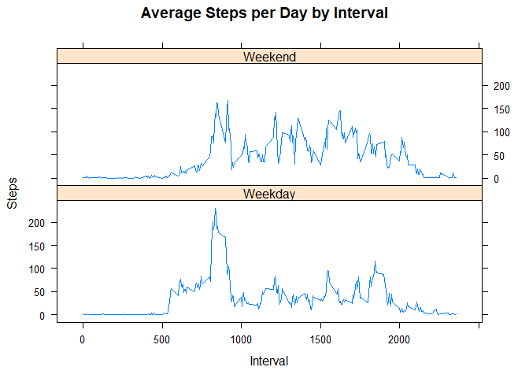

## Introduction
It is now possible to collect a large amount of data about personal movement using activity monitoring devices such as a Fitbit, Nike Fuelband, or Jawbone Up. These type of devices are part of the “quantified self” movement – a group of enthusiasts who take measurements about themselves regularly to improve their health, to find patterns in their behavior, or because they are tech geeks. But these data remain under-utilized both because the raw data are hard to obtain and there is a lack of statistical methods and software for processing and interpreting the data.

This assignment makes use of data from a personal activity monitoring device. This device collects data at 5 minute intervals through out the day. The data consists of two months of data from an anonymous individual collected during the months of October and November, 2012 and include the number of steps taken in 5 minute intervals each day.

The data for this assignment can be downloaded from the course web site:

* Dataset: [Activity monitoring data](https://d396qusza40orc.cloudfront.net/repdata%2Fdata%2Factivity.zip) 

The variables included in this dataset are:

steps: Number of steps taking in a 5-minute interval (missing values are coded as 𝙽𝙰) </br>
date: The date on which the measurement was taken in YYYY-MM-DD format </br>
interval: Identifier for the 5-minute interval in which measurement was taken </br>
The dataset is stored in a comma-separated-value (CSV) file and there are a total of 17,568 observations in this dataset. 

# Loading and preprocessing the data
### Unzip data to obtain a csv file.


```r
if (!file.exists("activity.csv") )
{
  dlurl <- 'http://d396qusza40orc.cloudfront.net/repdata%2Fdata%2Factivity.zip'  
  download.file(dlurl,destfile='repdata%2Fdata%2Factivity.zip',mode='wb')  
  unzip('repdata%2Fdata%2Factivity.zip')
}
```

### Reading csv Data into Data.Table.

```r
data <- data.table::fread("activity.csv")  
```

# What is mean total number of steps taken per day?

### 1. Calculate the total number of steps taken per day


```r
steps_by_day <- aggregate(steps ~ date, data, sum)
```

### 2. Make a histogram of the total number of steps taken each day. 


```r
hist(steps_by_day$steps, main = paste("Total Steps Each Day"), col="green",xlab="Number of Steps")
```

<!-- -->

###  3. Calculate and report the mean and median of the total number of steps taken per day

```r
rmean <- mean(steps_by_day$steps)
rmean
```

```
## [1] 10766.19
```

```r
rmedian <- median(steps_by_day$steps)
rmedian
```

```
## [1] 10765
```

median of the total number of steps taken per day:10765
mean of the total number of steps taken per day: 1.0766189\times 10^{4}


# What is the average daily activity pattern?

### 1.Make a time series plot (i.e. \color{red}{\verb|type = "l"|}type = "l") of the 5-minute interval (x-axis) and the average number of steps taken, averaged across all days (y-axis)


```r
steps_by_interval <- aggregate(steps ~ interval, data, mean)
plot(steps_by_interval$interval,steps_by_interval$steps, type="l", xlab="Interval", ylab="Number of Steps",main="Average Number of Steps per Day by Interval")
```

<!-- -->

### 2. Which 5-minute interval, on average across all the days in the dataset, contains the maximum number of steps?


```r
max_interval <- steps_by_interval[which.max(steps_by_interval$steps),1]
max_interval
```

```
## [1] 835
```

The interval with most steps is 835


# Imputing missing values

### 1. Calculate and report the total number of missing values in the dataset (i.e. the total number of rows with 𝙽𝙰s)


```r
NATotal <- sum(!complete.cases(data))
NATotal
```

```
## [1] 2304
```

Total Number of Missing values are 2304

### 2. Devise a strategy for filling in all of the missing values in the dataset. The strategy does not need to be sophisticated. For example, you could use the mean/median for that day, or the mean for that 5-minute interval, etc.


```r
# Filling in missing values with median of dataset. 
StepsAverage <- aggregate(steps ~ interval, data = data, FUN = mean)
fillNA <- numeric()
for (i in 1:nrow(data)) {
  obs <- data[i, ]
  if (is.na(obs$steps)) {
    steps <- subset(StepsAverage, interval == obs$interval)$steps
  } else {
    steps <- obs$steps
  }
  fillNA <- c(fillNA, steps)
}
```

### 3. Create a new dataset that is equal to the original dataset but with the missing data filled in.


```r
new_activity <- data
new_activity$steps <- fillNA
```

### 4. Make a histogram of the total number of steps taken each day and calculate and report the mean and median total number of steps taken per day. Do these values differ from the estimates from the first part of the assignment? What is the impact of imputing missing data on the estimates of the total daily number of steps?


```r
StepsTotalUnion <- aggregate(steps ~ date, data = new_activity, sum, na.rm = TRUE)
hist(StepsTotalUnion$steps, main = paste("Total Steps Each Day"), col="blue", xlab="Number of Steps")
hist(steps_by_day$steps, main = paste("Total Steps Each Day"), col="green", xlab="Number of Steps", add=T)
legend("topright", c("Imputed", "Non-imputed"), col=c("blue", "green"), lwd=10)
```

<!-- -->

```r
rmeantotal <- mean(StepsTotalUnion$steps)
rmeantotal
```

```
## [1] 10766.19
```

```r
rmediantotal <- median(StepsTotalUnion$steps)
rmediantotal
```

```
## [1] 10766.19
```

Do these values differ from the estimates from the first part of the assignment?


```r
rmediandiff <- rmediantotal - rmedian
rmediandiff
```

```
## [1] 1.188679
```

```r
rmeandiff <- rmeantotal - rmean
rmeandiff
```

```
## [1] 0
```

Ans. The mean(Mean Var: 0) is the same however the median does have a small variance(Median Var:1.1886792). between the total which includes the missing values to the base
#What is the impact of imputing missing data on the estimates of the total daily number of steps?
On observation the impact of the missing data has the biggest effect on the 10000 - 150000 step interval and changes frequency from 27.5 to 35 a variance of 7.5

## Are there differences in activity patterns between weekdays and weekends?

### 1. Create a new factor variable in the dataset with two levels – “weekday” and “weekend” indicating whether a given date is a weekday or weekend day.


```r
weekdays <- c("Monday", "Tuesday", "Wednesday", "Thursday", 
              "Friday")
new_activity$dow = as.factor(ifelse(is.element(weekdays(as.Date(new_activity$date)),weekdays), "Weekday", "Weekend"))
StepsTotalUnion <- aggregate(steps ~ interval + dow, new_activity, mean)
```
### 2.Make a panel plot containing a time series plot (i.e. \color{red}{\verb|type = "l"|}type = "l") of the 5-minute interval (x-axis) and the average number of steps taken, averaged across all weekday days or weekend days (y-axis).

```r
library(lattice)
xyplot(StepsTotalUnion$steps ~ StepsTotalUnion$interval|StepsTotalUnion$dow, main="Average Steps per Day by Interval",xlab="Interval", ylab="Steps",layout=c(1,2), type="l")
```

<!-- -->


